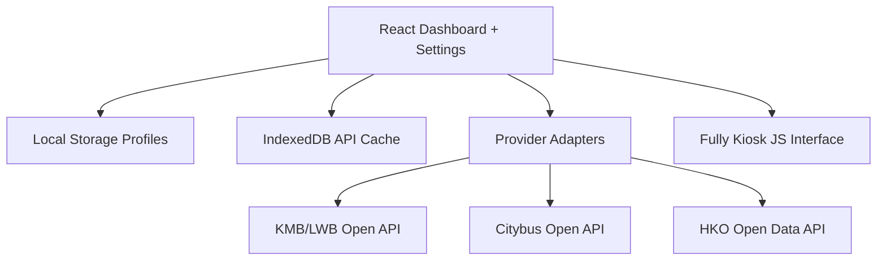

# V1 需求、架構、資料模型及實作計劃

## 已確認需求

| 項目 | V1 決定 |
|---|---|
| 地區 | 香港 only |
| 裝置 | Samsung Galaxy Tab A8 SM-X200，固定 landscape |
| 主要用戶 | 香港長者及家傭；繁中＋英文同時顯示 |
| 巴士 | KMB/LWB、Citybus；聯營來源合併 |
| 天氣 | 香港天文台統一 provider，含官方警告 |
| 設定 | 多 Profile；搜尋路線／方向／站牌；排序、1–3 ETA、30–300 秒更新 |
| 安全 | 長按時間 3 秒；6 位 Admin PIN；Profile 切換不需 PIN |
| 儲存 | Local Storage；API cache 用 IndexedDB；JSON Import／Export 不含 PIN |
| 夜間 | 可選長開；預設 20:00 熄屏、06:30 亮屏 |
| 部署 | 無 cloud host、無 GitHub；Fully Kiosk 載入本機 bundle |
| QC | KMB 289K，大學站 ST906，站序 1，往富安花園循環線 |

## 架構



V1 不需要 backend：三個來源均是官方公開、毋須 secret 的 API。若日後加入需 token 的 provider，secret 必須放在 LAN backend 或其他受控 server，frontend 不會保存 token。

每個 provider 由獨立 adapter 正規化成相同 ETA／weather shape。Dashboard 用 `Promise.allSettled` 隔離故障，因此單一 API timeout 或格式錯誤只影響自己的卡，不會令整頁白屏。網絡請求有 timeout、一次 retry、cache 及 stale 狀態；最後成功資料可離線顯示。

## 核心資料模型

```ts
type AppConfig = {
  schemaVersion: 1;
  activeProfileId: string;
  refreshSeconds: number;       // 30..300
  adminPin?: PinDigest;         // PBKDF2 salt/hash；不會 export
  profiles: Profile[];
};

type Profile = {
  id: string;
  nameTc: string;
  nameEn: string;
  weatherStationTc: string;
  weatherStationEn: string;
  transitBoards: TransitBoard[];
  display: {
    alwaysOn: boolean;
    sleepTime: string;
    wakeTime: string;
    theme: "kmb" | "dark";
    pixelShift: boolean;
  };
};

type TransitBoard = {
  route: string;
  sources: TransitSource[];     // 聯營線可有多個來源
  etaLimit: 1 | 2 | 3;
  sortOrder: number;
};

type TransitSource = {
  provider: "kmb" | "citybus";
  operator: "KMB/LWB" | "CTB";
  route: string;
  direction: "inbound" | "outbound";
  serviceType: string;
  stopId: string;
  stopSequence: number;         // 循環線必要，防止同站回程混入
  stopNameTc: string;
  stopNameEn: string;
  destinationTc: string;
  destinationEn: string;
};
```

## V1 範圍

### 包含

- 香港雙語全螢幕資訊板及 Settings
- HKO current weather、雨量、warning summary
- KMB/LWB、Citybus 路線與站牌搜尋及 ETA
- 聯營 ETA 合併、排序、去重
- 多 Profile、PIN、Import／Export、離線／故障狀態
- Fully Kiosk 螢幕時間同步、固定 landscape、pixel shift
- SM-X200 本機安裝 bundle 及 APK

### 不包含

- 台灣／TDX
- 雲端同步、登入帳戶、遠端管理後台
- 港鐵、小巴、渡輪
- iOS
- 自動背景 APK 更新

## Implementation plan 狀態

1. 官方 API contract 及 289K 站序驗證 — 完成
2. Mobile-first landscape Dashboard 及雙語 Settings — 完成
3. timeout、retry、cache、offline fallback、PIN、Import／Export — 完成
4. Fully Kiosk 本機部署及 Android APK — 完成
5. 自動測試、production build、live API QC — 完成
6. SM-X200 實機 sleep/wake、boot、字體距離驗收 — 待安裝後執行
